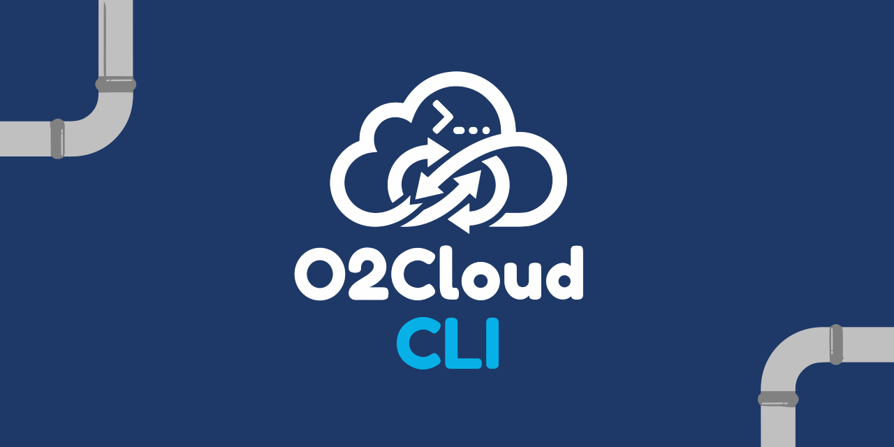

# o2cloud-cli

<p align="center">
  
</p>

[](https://crates.io/crates/o2cloud-cli)
[](./LICENSE)

CLI para O2 Cloud (Telefónica España) — gestiona tu almacenamiento cloud desde la terminal.

[English](README.md)

## Instalación

```bash
cargo install o2cloud-cli
```

O compilar desde fuente:

```bash
git clone https://github.com/danielperez9430/o2cloud-cli
cd o2cloud-cli
cargo build --release
./target/release/o2cloud --help
```

## Uso

```bash
# Autenticación (abre ventana WebView)
o2cloud login

# Listar archivos
o2cloud ls                  # raíz
o2cloud ls /DMHAIR          # carpeta por path
o2cloud ls -t               # vista de árbol
o2cloud ls -a               # todos los archivos (plano)

# Buscar
o2cloud find "consulta"     # búsqueda case-insensitive

# Subir
o2cloud upload archivo.txt
o2cloud upload-dir ./mi-carpeta      # recursivo
o2cloud upload-zip ./mi-carpeta      # zip + subir

# Descargar
o2cloud download 1195003130 -o archivo.txt

# Borrar (papelera)
o2cloud rm 1195003130                # archivo por ID
o2cloud rm /ruta/carpeta -r          # carpeta recursiva

# Sesión
o2cloud status
o2cloud logout
```

## Requisitos

- macOS o Linux
- Cuenta de O2 Cloud (Telefónica España)
- Linux: `sudo apt install libwebkit2gtk-4.1-dev libgtk-3-dev`

## Cómo funciona

O2 Cloud usa **Synchronoss OneMediaHub v31** como backend. La autenticación va por **Telefónica Mobile Connect** (OAuth2/OpenID Connect). El CLI abre un WebView para que introduzcas tu número y valides por SMS. Tras el login, los tokens se guardan en:

- macOS: `~/Library/Application Support/o2cloud-cli/auth.json`
- Linux: `~/.config/o2cloud-cli/auth.json`

La sesión se renueva silenciosamente al expirar — no necesitas volver a hacer login.

## Licencia

MIT
